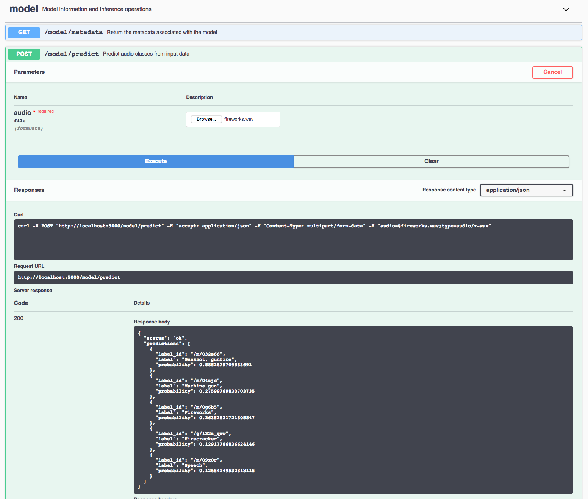

# IBM Code Model Asset Exchange: Audio Classifier

This repository contains code to instantiate and deploy an audio classification model. This model recognizes a signed 16-bit
PCM wav file as an input, generates embeddings, applies
[PCA transformation/quantization](https://github.com/tensorflow/models/tree/master/research/audioset#output-embeddings),
uses the embeddings as an input to a multi-attention classifier and outputs top 5 class predictions and probabilities as output. 
The model currently supports 527 classes which are part of the [Audioset Ontology](https://research.google.com/audioset/ontology/index.html). The classes and the label_ids can be found in [class_labels_indices.csv](assets/class_labels_indices.csv). 
The model was trained on [AudioSet](https://research.google.com/audioset/) as described in the paper ['Multi-level Attention Model for Weakly Supervised Audio Classification'](https://arxiv.org/abs/1803.02353) by Yu et al.

The model has been tested across multiple audio classes, however it tends to perform best for Music / Speech categories. This is largely due to the bias towards these classes in the training dataset (90% of audio belong to either of these categories). Though the model is trained on data from Audioset which was extracted from YouTube videos, the model can be applied to a wide range of audio files outside the domain of music/speech. The test assets provided along with this model provide a broad range.

The model files are hosted on IBM Cloud Object Storage. The code in this repository deploys the model as a web service
in a Docker container. This repository was developed as part of the
[IBM Code Model Asset Exchange](https://developer.ibm.com/code/exchanges/models/).

## Model Metadata
| Domain | Application | Industry  | Framework | Training Data | Input Data Format |
| ------------- | --------  | -------- | --------- | --------- | -------------- |
| Audio | Classification | Multi | Keras/TensorFlow | Google AudioSet | signed 16-bit PCM WAV audio file |

## References

* _Jort F. Gemmeke, Daniel P. W. Ellis, Dylan Freedman, Aren Jansen, Wade Lawrence, R. Channing Moore, Manoj Plakal, Marvin Ritter_,["Audio set: An ontology and human-labeled dataset for audio events"](https://static.googleusercontent.com/media/research.google.com/en//pubs/archive/45857.pdf), IEEE ICASSP, 2017.

* _Qiuqiang Kong, Yong Xu, Wenwu Wang, Mark D. Plumbley_,["Audio Set classification with attention model: A probabilistic perspective."](https://arxiv.org/pdf/1711.00927.pdf) arXiv preprint arXiv:1711.00927 (2017).

* _Changsong Yu, Karim Said Barsim, Qiuqiang Kong, Bin Yang_ ,["Multi-level Attention Model for Weakly Supervised Audio Classification."](https://arxiv.org/pdf/1803.02353.pdf) arXiv preprint arXiv:1803.02353 (2018).

* _S. Hershey, S. Chaudhuri, D. P. W. Ellis, J. F. Gemmeke, A. Jansen,
R. C. Moore, M. Plakal, D. Platt, R. A. Saurous, B. Seybold et  al._,
["CNN architectures for large-scale audio classification,"](https://arxiv.org/pdf/1609.09430.pdf) arXiv preprint
arXiv:1609.09430, 2016.


## Licenses

| Component | License | Link  |
| ------------- | --------  | -------- |
| This repository | [Apache 2.0](https://www.apache.org/licenses/LICENSE-2.0) | [LICENSE](LICENSE) |
| Model Files | [Apache 2.0](https://github.com/tensorflow/models/blob/master/LICENSE) | [AudioSet](https://github.com/tensorflow/models/tree/master/research/audioset) |
| Model Code | [MIT](https://github.com/qiuqiangkong/audioset_classification/blob/master/LICENSE.txt) | [AudioSet Classification](https://github.com/qiuqiangkong/audioset_classification) |
| Test assets | Various | [Asset README](assets/README.md) |


## Pre-requisites:

* `docker`: The [Docker](https://www.docker.com/) command-line interface. Follow the [installation instructions](https://docs.docker.com/install/) for your system.
* The minimum recommended resources for this model is 8 GB Memory and 4 CPUs.

# Steps

1. [Deploy from Docker Hub](#deploy-from-docker-hub)
2. [Deploy on Kubernetes](#deploy-on-kubernetes)
3. [Run Locally](#run-locally)

## Deploy from Docker Hub

To run the docker image, which automatically starts the model serving API, run:

```
$ docker run -it -p 5000:5000 codait/max-audio-classifier
```

This will pull a pre-built image from Docker Hub (or use an existing image if already cached locally) and run it.
If you'd rather checkout and build the model locally you can follow the [run locally](#run-locally) steps below.

## Deploy on Kubernetes

You can also deploy the model on Kubernetes using the latest docker image on Docker Hub.

On your Kubernetes cluster, run the following commands:

```
$ kubectl apply -f https://raw.githubusercontent.com/IBM/MAX-Audio-Classifier/master/max-audio-classifier.yaml
```

The model will be available internally at port `5000`, but can also be accessed externally through the `NodePort`.

## Run Locally

1. [Build the Model](#1-build-the-model)
2. [Deploy the Model](#2-deploy-the-model)
3. [Use the Model](#3-use-the-model)
4. [Development](#4-development)
5. [Cleanup](#5-cleanup)

### 1. Build the Model

Clone this repository locally. In a terminal, run the following command:

```
$ git clone https://github.com/IBM/MAX-Audio-Classifier.git
```

Change directory into the repository base folder:

```
$ cd MAX-Audio-Classifier
```

To build the Docker image locally, run:

```
$ docker build -t max-audio-classifier .
```

All required model assets will be downloaded during the build process. _Note_ that currently this Docker image is CPU
only (we will add support for GPU images later).


### 2. Deploy the Model

To run the Docker image, which automatically starts the model serving API, run:

```
$ docker run -it -p 5000:5000 max-audio-classifier
```

### 3. Use the Model

The API server automatically generates an interactive Swagger documentation page. Go to `http://localhost:5000` to load
it. From there you can explore the API and also create test requests.

_Note_ : The input is a 10 second signed 16-bit PCM wav audio file. Files longer than 10 seconds will be clipped so that only the first 10 seconds will be used by the model. Conversely, files shorter than 10 seconds will be repeated to create a clip 10 seconds in length.

Use the `model/predict` endpoint to load a signed 16-bit PCM wav audio file (you can use the `fireworks.wav` file located
in the `assets` folder) and get predictions from the API.



You can also test it on the command line, for example (with the `thunder.wav` file):

```
$ curl -F "audio=@assets/thunder.wav" -XPOST http://localhost:5000/model/predict
```

You should see a JSON response like that below:

```
{
    "status": "ok",
    "predictions": [
        {
            "label_id": "/m/06mb1",
            "label": "Rain",
            "probability": 0.7376469373703003
        },
        {
            "label_id": "/m/0ngt1",
            "label": "Thunder",
            "probability": 0.60517817735672
        },
        {
            "label_id": "/t/dd00038",
            "label": "Rain on surface",
            "probability": 0.5905200839042664
        },
        {
            "label_id": "/m/0jb2l",
            "label": "Thunderstorm",
            "probability": 0.5793699026107788
        },
        {
            "label_id": "/m/07yv9",
            "label": "Vehicle",
            "probability": 0.34878015518188477
        }
    ]
}
```

### 4. Development

To run the Flask API app in debug mode, edit `config.py` to set `DEBUG = True` under the application settings. You will
then need to rebuild the Docker image (see [step 1](#1-build-the-model)).

### 5. Cleanup

To stop the Docker container, type `CTRL` + `C` in your terminal.
